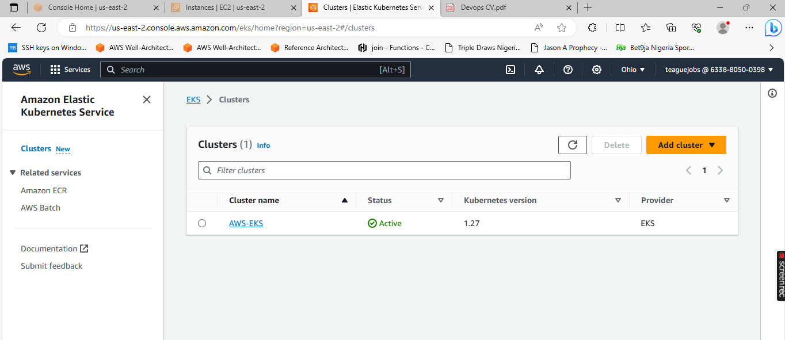

Step 1:- Create the module for VPC

- Create main.tf file and add the below code to it.

- Create variables.tf file and add the below code to it.

- Create outputs.tf file and add the below code to it.

Step 2:- Create the module for the Security Group

- Create main.tf file and add the below code to it.

- Create variables.tf and add the below code to it.

- Create outputs.tf file and add the below code to it.

Step 3:- Create the module for the Key Pair

- For this project I have already created the key pair on AWS so, I will just fetch the key from AWS.

- Create main.tf file and add the below code to it.

- Create variables.tf file and add the below code to it.

- Create outputs.tf file and add the below code to it.

Step 4:- Create the module for the IAM Role

- Create main.tf file and add the below code to it.

- The above code will create the IAM role for the master and worker nodes and attach the necessary policy to it.

- Create outputs.tf file and add the below code to it.

Step 5:- Create the module for the EKS

- Create main.tf file and add the below code to it.

- Create variables.tf file and add the below code to it.

- Create outputs.tf file and add the below code to it.

Step 6: Initialize the working directory

- Run `terraform init` command in the working directory. It will download all the necessary providers, and all the modules & also initialize the backend as well.

Step 7:- Create a terraform plan

- Run `terraform plan` command in the working directory. It will give the execution plan.

Step 8:- Create a terraform apply

- Run `terraform apply` command in the working directory. It will be going to create the Kubernetes cluster on AWS

- Terraform will create the below resources on AWS

1. VPC
2. Route Table
3. Subnets
4. IAM Role
5. Internet Gateway
6. Security Group
7. Worker Nodes
8. EKS Cluster

Launch Kubectl Server

[AWS LINK](https://https://docs.aws.amazon.com/eks/latest/userguide/install-kubectl.html)

See the below command and replace it with the name of your EKS cluster and with the AWS region where the cluster is located.

`aws eks update-kubeconfig - name <your-cluster-name> - region <your-region>`

`kubectl get nodes`

